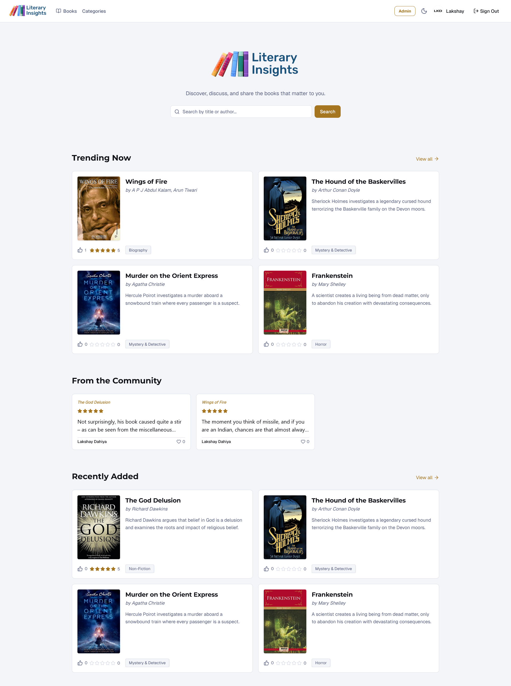
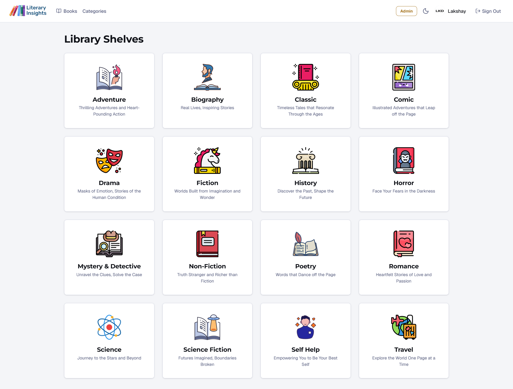
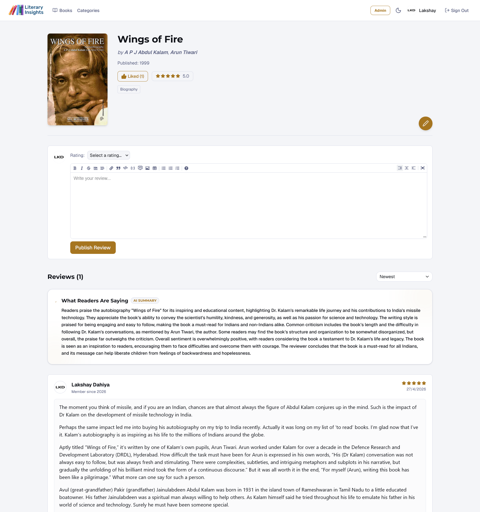
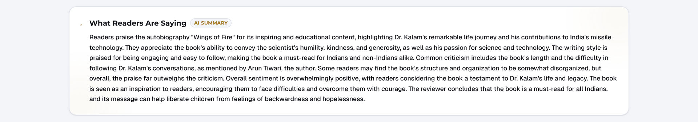
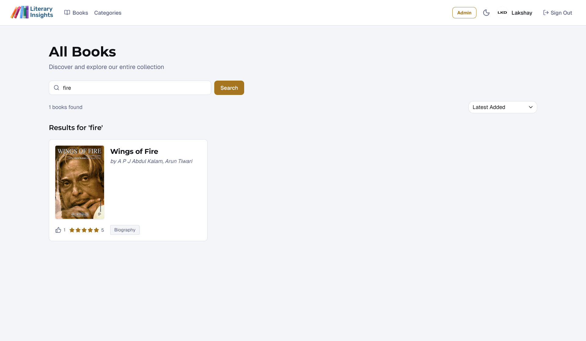
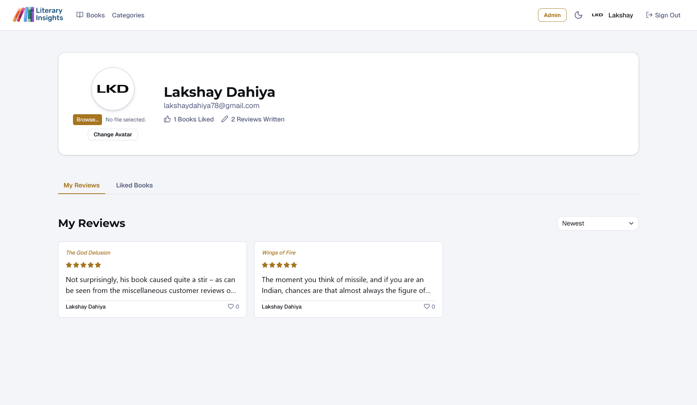
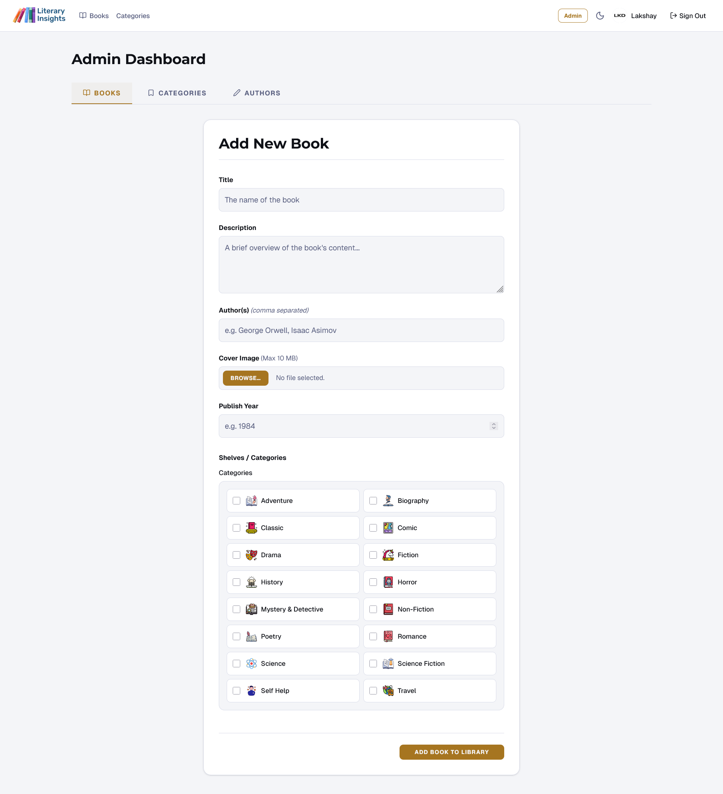

# Literary Insights

> A full-stack social reading platform for discovering books, publishing reviews, and surfacing community insight with AI.

## 📸 Screenshots

### Login / Signup Page


### Home Page



### Books Divided in Categories



### Light & Dark Themes


### Book Detail & Reviews



### AI Review Summary



### Search Functionality



### Profile Page



### Admin Panel



## 🚀 Features

### Core Features

- Full authentication flow (signup, email verification, login, logout) using Supabase Auth with SSR session handling and PKCE-compatible flow.
- Protected routes enforced via middleware and server-side user validation before rendering sensitive pages.
- Role-based access control with explicit admin checks for admin UI and mutations.
- Light/dark theme toggle with persisted preference in local storage for consistent UX across visits.

### Book Discovery

- Browse books by category, including category-specific pages with dynamic metadata and book counts.
- Search books by title or author name from the main books view.
- Sort and filter book/review feeds by latest, top rated, most liked, and most reviewed depending on context.
- Paginated listings for category books and book reviews to keep queries bounded and navigation fast.

### Community & Reviews

- Markdown-supported review editor for rich, readable review content.
- Star rating system (1-5) stored with each review and aggregated into per-book average ratings.
- Like/unlike interactions for both books and reviews with cached counter updates.
- AI-generated review summaries powered by Meta Llama 3.1 (8B Instruct) through HuggingFace Inference.
- Smart summary refresh using a review-change counter with edge-case handling for deletions and empty-state reset. The threshold is configurable (commonly 5 changes; local config can be tuned).

### Admin Panel

- Unified tabbed admin interface for books, categories, and authors.
- Add, edit, and delete workflows for books, authors, and categories.
- Image upload pipeline to Supabase Storage for book covers, author photos, category icons, and user avatars.
- Admin-only pages protected at page level and action level for defense-in-depth authorization.

### User Profile

- Avatar upload and replacement flow with old-file cleanup.
- Profile tabs for published reviews and liked books.
- Tab-based layout with sorting controls for reviews and liked content.

## 🛠 Tech Stack

| Layer      | Technology                                  |
| ---------- | ------------------------------------------- |
| Framework  | Next.js 16 (App Router, Turbopack)          |
| Language   | TypeScript                                  |
| Styling    | Tailwind CSS v4                             |
| Database   | PostgreSQL via Supabase                     |
| ORM        | Prisma 7                                    |
| Auth       | Supabase Auth (SSR/PKCE)                    |
| Storage    | Supabase Storage                            |
| AI         | Meta Llama 3.1 8B via HuggingFace Inference |
| Icons      | Lucide React                                |
| Deployment | Vercel / Render                             |

## 🏗 Architecture Highlights

- Server Components are used for data-heavy route rendering, while Client Components are used for interactive controls (theme switch, markdown editor, like actions, sort controls).
- Cached counters on domain models (likeCount, reviewCount, averageRating, bookCount) reduce expensive aggregations at read time and keep listing queries efficient.
- AI summary generation is decoupled behind a review-change threshold mechanism and includes safe handling for edge cases like last-review deletion (summary reset).
- Supabase key separation is enforced: publishable key for browser/server session clients, service-role key only for privileged storage operations on the server.
- Mutations are implemented with Server Actions for tight auth checks, typed form handling, and direct cache invalidation without a separate REST layer.
- Home page data is fetched in parallel using Promise.all to reduce time-to-first-byte for multi-section landing content.
- Supabase Storage and profile table policies are explicitly managed with SQL to preserve RLS boundaries and public-read behavior where required.

## 🗄 Database Schema

```text
User
- id (PK)
- email (unique)
- name
- avatarUrl
- isAdmin
- createdAt

Author
- id (PK)
- name (unique)
- bio
- photoUrl

Category
- id (PK)
- name (unique)
- description
- icon
- bookCount

Book
- id (PK)
- title
- description
- publishYear
- coverUrl
- aiSummary
- reviewChangeCount
- reviewCount
- likeCount
- averageRating
- createdAt

BookVote
- id (PK)
- userId (FK -> User.id)
- bookId (FK -> Book.id)
- unique(userId, bookId)

Review
- id (PK)
- content
- rating
- reviewLikes
- createdAt
- userId (FK -> User.id)
- bookId (FK -> Book.id)
- unique(userId, bookId)

Relations
- User 1---* Review
- User 1---* BookVote
- User *---* Book (favorites)
- Author *---* Book
- Category *---* Book
- Book 1---* Review
- Book 1---* BookVote
```

## 🚀 Getting Started

### Prerequisites

- Node.js 20.19+
- Supabase project
- HuggingFace account (free tier)

### Installation

```bash
git clone https://github.com/LakshayDahiya77/BookForum
cd BookForum
npm install
```

### Environment Variables

Create a .env file with:

```env
NEXT_PUBLIC_SUPABASE_URL=
NEXT_PUBLIC_SUPABASE_PUBLISHABLE_KEY=
SUPABASE_SERVICE_ROLE_KEY=
DATABASE_URL=
DIRECT_URL=
HF_TOKEN=
```

### Database Setup

1. Initialize schema with Prisma:

```bash
npx prisma generate
npx prisma db push
```

2. Apply custom SQL for auth trigger and storage/RLS policies:

```bash
psql "$DATABASE_URL" -f prisma/custom-sql/01-auth-trigger.sql
psql "$DATABASE_URL" -f prisma/custom-sql/02-storage-policies.sql
```

### Run locally

```bash
npm run dev
```

## 📁 Project Structure

```text
src/
|-- app/                  # Next.js App Router pages, route groups, and server actions
|   |-- (auth)/           # Login and account confirmation routes
|   |-- admin/            # Unified admin dashboard and dedicated admin screens
|   |-- authors/          # Author detail routes
|   |-- books/            # Book listing, detail, reviews, likes, and pagination
|   |-- categories/       # Category listing and category-specific book feeds
|   |-- profile/          # User profile, avatar management, reviews, liked books
|   |-- layout.tsx        # Global app layout shell
|   |-- page.tsx          # Home page with parallel data sections
|   |-- globals.css       # Theme variables and global styles
|-- components/           # Reusable UI components (cards, selectors, editor, header)
|   |-- buttons/          # Shared button primitives
|-- config/               # Central app-level constants and thresholds
|-- lib/                  # Data/auth/AI/storage integrations and shared utilities
|   |-- ai/               # HuggingFace summary generation service
|   |-- supabase/         # Browser, server, middleware, and admin Supabase clients
|-- proxy.ts              # Edge proxy/middleware entry for session refresh and route protection
```

## 🔐 Security Considerations

- Admin authorization is enforced in both page rendering and server actions, reducing bypass risk through direct mutation calls.
- Supabase service-role key is server-only and used exclusively for privileged storage operations; it is never exposed to client code.
- Row Level Security policies are explicitly applied for storage objects and user profile reads to align access with authenticated identity.
- Auth uses Supabase SSR flows with PKCE-compatible exchange and middleware-based session refresh to keep tokens and cookies synchronized.
